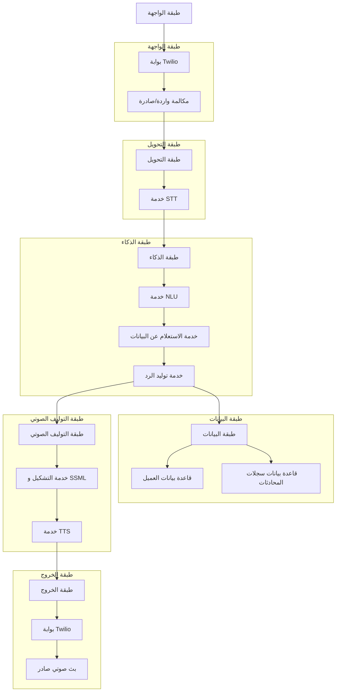

# مشروع صدى999 (Project Sada999)

## المخطط التكويني والتنفيذي

---

### **القسم الأول: الاستراتيجية التقنية ومصفوفة التبرير**

#### مصفوفة تبرير الحزمة التقنية (Technology Stack Justification Matrix)

| طبقة النظام (System Layer) | التقنية الموصى بها (Recommended Tech) | التبرير الاستراتيجي (Strategic Justification) | البدائل الرئيسية (Key Alternatives) |
| :--- | :--- | :--- | :--- |
| **بوابة الاتصالات (Telephony)** | Twilio API | موثوقية عالية، سهولة في الربط البرمجي، دعم عالمي واسع. | Vonage, Sinch |
| **تحويل الكلام إلى نص (STT)** | Google Speech-to-Text / Whisper V3 | دقة فائقة في اللغات المتعددة المطلوبة، دعم للتعرف اللحظي (real-time). | Azure Speech, AWS Transcribe |
| **فهم اللغة والنوايا (NLU)** | Google Dialogflow / Rasa / Llama 3 | قدرة عالية على تحديد النية (Intent) واستخراج الكيانات (Entities) بدقة. | Microsoft LUIS, Amazon Lex |
| **منطق البحث في قاعدة البيانات**| Python (SQLAlchemy/Pandas) + Vector DB | مرونة في التعامل مع قواعد بيانات SQL التقليدية والبحث الدلالي في قواعد البيانات المتجهة (Vector DB) للمعرفة. | Node.js with Prisma |
| **توليد وصياغة الرد (NLG)** | GPT-4o / Llama 3 | قدرة استثنائية على صياغة ردود طبيعية وشبه بشرية بناءً على البيانات المسترجعة. | Google Gemini |
| **تحويل النص إلى كلام (TTS)** | Google Text-to-Speech / ElevenLabs | أصوات طبيعية جدًا، ودعم شامل لـ SSML لتشكيل النبرة والمشاعر، وتوفر أصوات عالية الجودة للغات المطلوبة. | Azure Neural Voices |
| **قاعدة بيانات المحادثات** | MongoDB / PostgreSQL | MongoDB للسرعة والمرونة في تخزين المحادثات النصية (JSON). PostgreSQL للصلابة ودعم البحث المتقدم. | Firebase, DynamoDB |

---

### **القسم الثاني: المخطط المعماري (Infographic)**

#### مخطط معماري النظام قائم على الخدمات المصغرة (Microservices)

---

### **القسم الثالث: خارطة طريق التنفيذ والمنطق الأساسي**

#### خارطة طريق تطوير "صدى999" (6 خطوات)

1.  **الخطوة 1: إعداد بوابة Twilio**
    - **المنطق البرمجي**: إنشاء تطبيق Twilio يستقبل المكالمات الصادرة والواردة باستخدام Webhook. يتم تفعيل WebSocket لمعالجة البث الصوتي الحي (Real-time Audio Stream). يتم ربط رقم هاتف عميل بتطبيق عبر واجهة برمجة التطبيقات (API) الخاصة بـ Twilio.
    - **النتيجة**: تمكين النظام من استقبال المكالمات ومعالجة الصوت في الوقت الفعلي.

2.  **الخطوة 2: بناء خدمة STT**
    - **المنطق البرمجي**: تطبيق خدمة تعمل كمسار موازٍ لمعالجة البث الصوتي من Twilio. يتم استخدام Google Speech-to-Text أو Whisper V3 للتحويل الفوري للكلام إلى نص. يتم تفعيل خاصية كشف اللغة التلقائي (Language Detection) لتحديد لغة المتصل تلقائيًا.
    - **النتيجة**: تحويل الكلام إلى نص نصي في الوقت الفعلي، مع تحديد اللغة المستخدمة.

3.  **الخطوة 3: بناء خدمة NLU**
    - **المنطق البرمجي**: بناء خدمة لتحليل النص وتحديد النية (Intent) مثل حجز موعد أو استعلام شحنة، واستخراج الكيانات (Entities) مثل رقم الحجز أو اسم الطبيب. يتم استخدام نماذج مسبقة التدريب أو نماذج مخصصة لكل لغة.
    - **النتيجة**: فهم دقيق لطلب المستخدم واستخراج المعلومات الضرورية لمعالجة الطلب.

4.  **الخطوة 4: بناء خدمة التفاعل مع البيانات**
    - **المنطق البرمجي**: بناء واجهة برمجة تطبيقات (API) تتفاعل مع قاعدة بيانات العميل بناءً على النية والكيانات المستخرجة. يتم استخدام قواعد بيانات SQL التقليدية مع دعم البحث الدلالي في قواعد البيانات المتجهة (Vector DB) للمعرفة.
    - **النتيجة**: استرجاع المعلومات المطلوبة من قاعدة البيانات بناءً على طلب المستخدم.

5.  **الخطوة 5: بناء خدمة التوليف الصوتي الكاملة**
    - **المنطق البرمجي**: 
        - استلام البيانات من قاعدة البيانات.
        - إرسالها إلى نموذج لغوي كبير (LLM) لصياغة الرد كنص بشري.
        - تمرير النص على خدمة "تشكيل" الحروف العربية.
        - إضافة علامات SSML ديناميكيًا (لتعديل السرعة، النبرة، التأكيد).
        - إرسال النص المعزز بـ SSML إلى خدمة TTS لتحويله إلى صوت.
    - **النتيجة**: توليد ردود صوتية طبيعية وشبه بشرية مع نبرة وتعبيرات مناسبة.

6.  **الخطوة 6: إدارة المحادثة والتخزين**
    - **المنطق البرمجي**: برمجة منطق الحوار الشامل، وتسجيل جميع التفاعلات لحظيًا في قاعدة البيانات باستخدام رقم المتصل كمعرف فريد للجلسة. يتم دمج آلية للتعامل مع المقاطعات والانتقالات بين المواضيع.
    - **النتيجة**: نظام متكامل لإدارة المحادثات مع الحفاظ على السياق وتخزين السجلات للاستخدام المستقبلي.

---

### **القسم الرابع: الشيفرة البرمجية الكاملة والنموذجية**

#### الكود الكامل للمشروع
