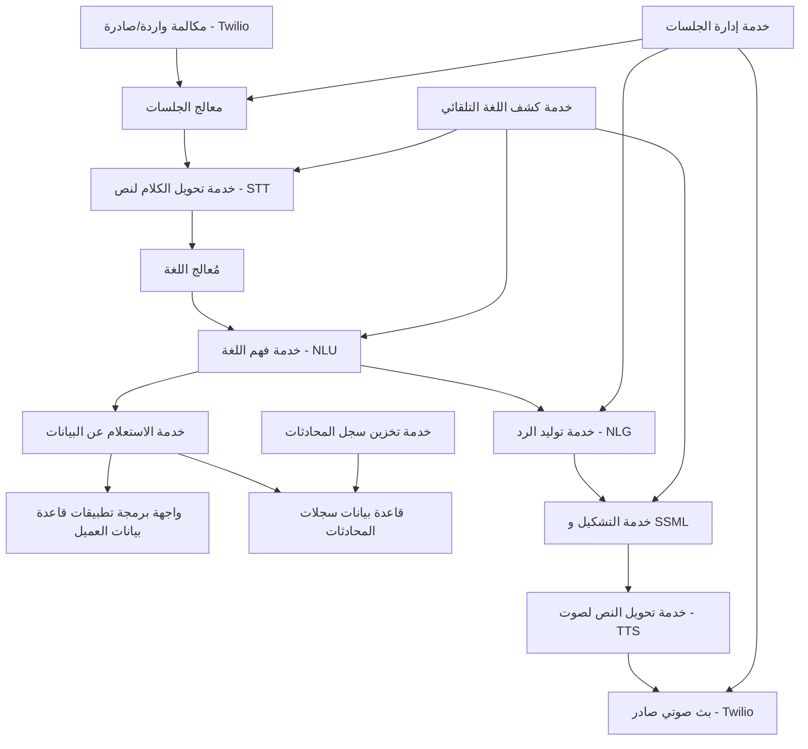

# القسم الثاني: المخطط المعماري (Infographic)

## مخطط معماري النظام قائم على الخدمات المصغرة (Microservices)

## شرح تفصيلي للمخطط المعماري

### طبقة الواجهة (Interface Layer)
- **دورها**: استقبال المكالمات الصادرة والواردة والتعامل مع بداية ونهاية كل جلسة اتصال.
- **المكونات**:
  - معالج الجلسات: يدير بداية ونهاية كل مكالمة ويربطها بمعرّف فريد.
  - خدمة إدارة الجلسات: تتبع حالة كل مكالمة (نشطة، على الانتظار، منتهية).

### طبقة التحويل (Transcription Layer)
- **دورها**: تحويل الكلام إلى نص باستخدام تقنيات STT المتقدمة.
- **المكونات**:
  - خدمة تحويل الكلام إلى نص: تستقبل البث الصوتي وتحوله إلى نص في الوقت الفعلي.
  - مُعالج اللغة: يتحقق من جودة النص ويقوم بتحسينه.
  - خدمة كشف اللغة التلقائي: تحدد لغة المتصل تلقائياً وتوجه النص إلى النموذج اللغوي المناسب.

### طبقة الذكاء (Intelligence Layer)
- **دورها**: فهم نية المتصل وإنشاء رد مناسب.
- **المكونات**:
  - خدمة فهم اللغة (NLU): تحليل النص، وتحديد النية، واستخراج الكيانات.
  - خدمة توليد الرد (NLG): صياغة رود طبيعية بناءً على البيانات المسترجعة.
  - خدمة الاستعلام عن البيانات: البحث في قاعدة بيانات العميل بناءً على النية والكيانات.

### طبقة البيانات (Data Layer)
- **دورها**: تخزين البيانات واسترجاعها بفعالية.
- **المكونات**:
  - واجهة برمجة تطبيقات قاعدة بيانات العميل: تواصل مع أنظمة العميل لاسترجاع المعلومات.
  - قاعدة بيانات سجلات المحادثات: تخزن تفاصيل كل محادثة للاستخدام المستقبلي.

### طبقة التوليف الصوتي (Synthesis Layer)
- **دورها**: تحويل النص الناتج إلى صوت طبيعي.
- **المكونات**:
  - خدمة التشكيل و SSML: تطبيق قواعد التشكيل على النص العربي وإضافة علامات SSML.
  - خدمة تحويل النص لصوت (TTS): تحويل النص إلى صوت باستخدام تقنيات متقدمة.

### طبقة الخروج (Egress Layer)
- **دورها**: إرسال الصوت الناتج إلى المتصل.
- **المكونات**:
  - بث صوتي صادر: إرسال الصوت إلى المتصل عبر بوابة Twilio.

## تدفق البيانات في النظام

1. **استقبال المكالمة**: يقوم Twilio باستقبال المكالمة وتمريرها إلى معالج الجلسات.
2. **تحويل الكلام إلى نص**: يتم تحويل الكلام إلى نص في الوقت الفعلي باستخدام خدمة STT.
3. **فهم اللغة**: يقوم النظام بتحليل النص لفهم نية المتصل واستخراج المعلومات المهمة.
4. **الاستعلام عن البيانات**: بناءً على النية، يقوم النظام بالبحث في قاعدة بيانات العميل.
5. **توليد الرد**: يقوم النظام بصياغة رد مناسب بناءً على البيانات المسترجعة.
6. **تحويل النص إلى صوت**: يتم تحويل الرد النصي إلى صوت باستخدام خدمة TTS مع تطبيق علامات SSML.
7. **إرسال الرد**: يتم إرسال الصوت إلى المتصل عبر بوابة Twilio.

هذا المخطط يضمن تدفق سلس للبيانات عبر جميع طبقات النظام، مع الحفاظ على انفصال الوظائف (Separation of Concerns) لكل خدمة مصغرة.
